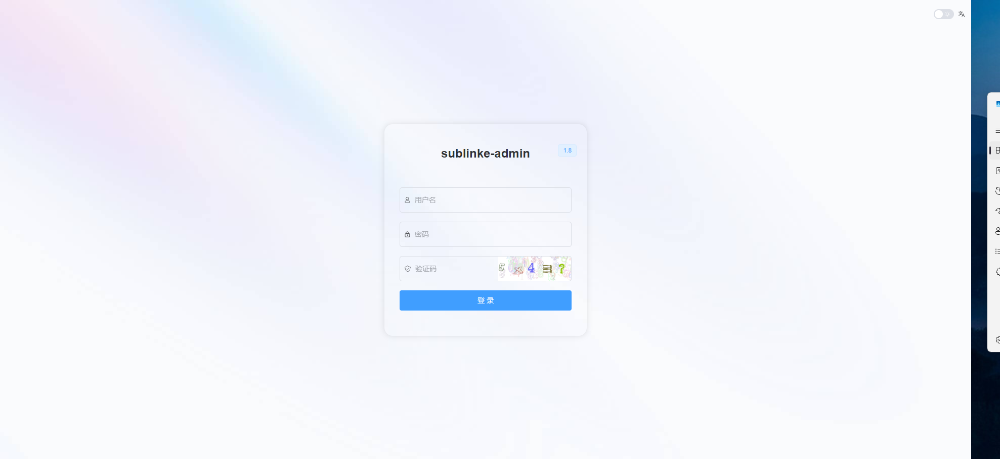
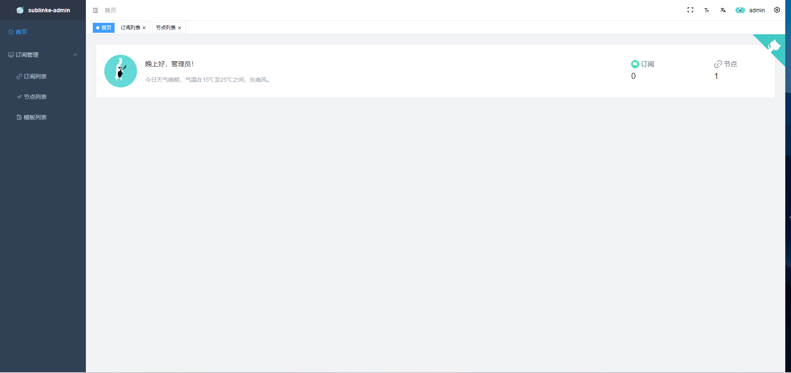
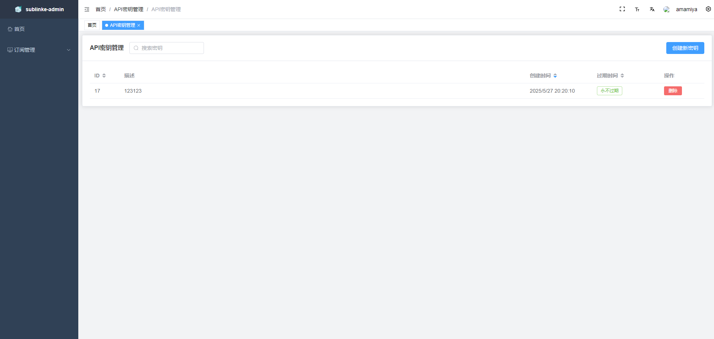
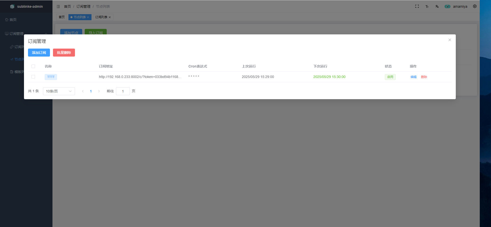

<div align="center">

</div>

<div align="center">
  
  
  
  
  <div align="center"> <a href="README.md">中文</a> | English</div>

</div>

# Project Introduction

`sublinkE` is an open-source node subscription conversion and management system based on secondary development of [sublinkX](https://github.com/gooaclok819/sublinkX).

- Frontend based on [vue3-element-admin](https://github.com/youlaitech/vue3-element-admin);
- Backend built with Go + Gin + Gorm;
- Default account: admin, password: 123456. Please change these credentials after installation;

# Modifications

- [x] Fixed some bugs
- [x] Support for Clash `dialer-proxy` attribute
- [x] Allow adding and using API KEY to access API
- [x] Import and scheduled updates of nodes from subscription links
- [ ] ...

# Project Features

- High flexibility and security, supports subscription access records and simple configuration management;
- Supports multiple client protocols and formats, including:
    - v2ray (base64 universal format)
    - clash (supports ss, ssr, trojan, vmess, vless, hy, hy2, tuic)
    - surge (supports ss, trojan, vmess, hy2, tuic)
- Added token authorization and subscription import functionality for enhanced security and convenience.

# Installation Instructions

```bash
docker run --name sublinke -p 8000:8000 \
-e API_ENCRYPTION_KEY="your-encryption-key" \  # Set this if you need to use API functionality
-v $PWD/db:/app/db \
-v $PWD/template:/app/template \
-v $PWD/logs:/app/logs \
-d eun1e/sublinke 
```

## Manual Installation

### Prerequisites

- Go 1.22+
- Node.js 16+
- pnpm

### Steps

1. Clone the repository
```bash
git clone https://github.com/your-username/sublinkX.git
cd sublinkX
```

2. Backend setup
```bash
# Install Go dependencies
go mod tidy

# Run the application
go run main.go
```

3. Frontend setup (for development)
```bash
cd webs
pnpm install
pnpm run dev
```

4. Build for production
```bash
cd webs
pnpm run build
```

## Configuration

### Environment Variables

- `API_ENCRYPTION_KEY`: Encryption key for API functionality (required if using API features)
- `PORT`: Server port (default: 8000)
- `DB_PATH`: SQLite database file path

### Default Credentials

- Username: `admin`
- Password: `123456`

**⚠️ Important: Please change the default credentials immediately after installation for security reasons.**

## Features

### Node Management
- Add, edit, and delete proxy nodes
- Batch operations for multiple nodes
- Support for various proxy protocols

### Subscription Management
- Import subscription links
- Scheduled automatic updates with Cron expressions
- Real-time monitoring of last run and next run times
- Centralized management of multiple subscription sources

### Protocol Support
- **V2Ray**: Base64 universal format
- **Clash**: ss, ssr, trojan, vmess, vless, hysteria, hysteria2, tuic
- **Surge**: ss, trojan, vmess, hysteria2, tuic

### Security Features
- API key authentication
- Token-based authorization
- Access logging and monitoring
- IP-based access control

### Scheduler System
- Built-in Cron scheduler for automatic subscription updates
- 5-field Cron expression support (minute hour day month weekday)
- Real-time validation of Cron expressions
- Execution time tracking and monitoring

## API Usage

### Authentication
All API requests require authentication via API key or token.

### Endpoints
- `/api/v1/nodes` - Node management
- `/api/v1/subscriptions` - Subscription management
- `/api/v1/scheduler` - Scheduled task management

## Development

### Project Structure
```
├── api/           # API handlers
├── models/        # Database models
├── services/      # Business logic services
├── routers/       # Route definitions
├── utils/         # Utility functions
├── webs/          # Frontend Vue3 application
└── template/      # Configuration templates
```

### Contributing
1. Fork the repository
2. Create your feature branch
3. Commit your changes
4. Push to the branch
5. Create a Pull Request

## License

This project is licensed under the MIT License - see the [LICENSE](LICENSE) file for details.

# Project Preview






## Support

If you encounter any issues or have questions, please:
1. Check the existing issues
2. Create a new issue with detailed information
3. Provide logs and configuration details when possible

## Acknowledgments

- [sublinkX](https://github.com/gooaclok819/sublinkX) - Original project
- [vue3-element-admin](https://github.com/youlaitech/vue3-element-admin) - Frontend framework
- Go community for excellent libraries and tools